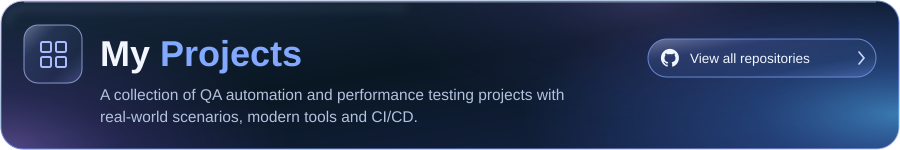
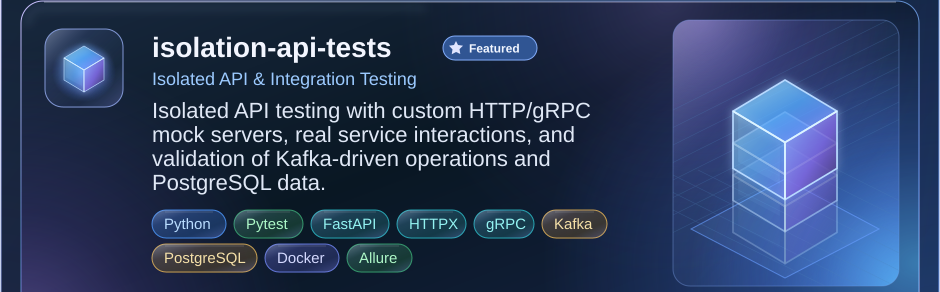
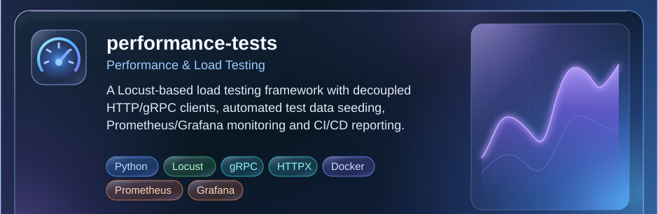
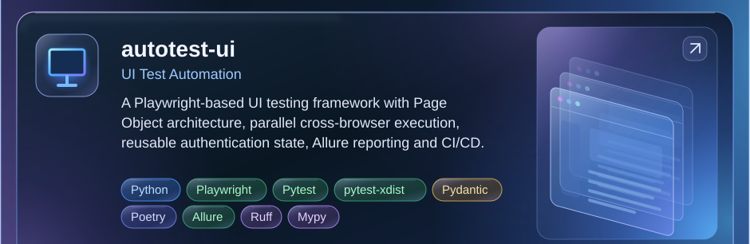

  <h1>Hi, I'm Kirill Molodykh 👋</h1>
  
<strong>Fullstack QA Engineer | Manual & Automation (Python)</strong>

  
<em>QA Engineer with a focus on manual testing and growing expertise in test automation with Python — from API and backend testing to performance and UI automation.</em>

  

    
    
  

---
<h3 align="left">
  <picture>
    <source media="(prefers-color-scheme: dark)" srcset="https://raw.githubusercontent.com/Barbaron86/Barbaron86/main/assets/headings/about-me-dark.svg" />
    
  </picture>
</h3>

* **Company:** **RWB (Wildberries & Russ)**
* **Testing Philosophy:** **Shift-Left Quality** — reliable, isolated and deterministic tests with fast CI feedback loops.
* **Quality Strategy:** **Full Test Pyramid** — isolated backend testing supported by targeted performance and UI automation.
* **Code Design:** Building reusable and extensible test frameworks with OOP, separation of concerns, and SOLID principles.
---

<h3 align="left">
  <picture>
    <source media="(prefers-color-scheme: dark)" srcset="https://raw.githubusercontent.com/Barbaron86/Barbaron86/main/assets/headings/tech-stack-dark.svg" />
    
  </picture>
</h3>

**Automation & Testing**

**Brokers, Databases & Storage**

**CI/CD, Infrastructure & Code Quality**

**Observability & Traffic Analysis**

---

<!-- BEGIN MY PROJECTS -->

  <a href="https://github.com/search?q=user%3ABarbaron86&amp;type=repositories"><picture><source media="(max-width: 480px), (min-width: 768px) and (max-width: 820px)" srcset="assets/projects/header-mobile.svg" width="100%" /><source media="(max-width: 1280px)" srcset="assets/projects/header-tablet.svg" width="100%" /></picture></a> 
  <a><picture><source media="(max-width: 480px), (min-width: 768px) and (max-width: 820px)" srcset="assets/projects/isolation-mobile.svg" width="100%" /><source media="(max-width: 1280px)" srcset="assets/projects/isolation-tablet.svg" width="100%" /></picture></a> 
  <a href="https://github.com/Barbaron86/isolation-api-tests"><picture><source media="(max-width: 480px), (min-width: 768px) and (max-width: 820px)" srcset="assets/projects/isolation-repository-mobile.svg" width="51.02040816%" /><source media="(max-width: 1280px)" srcset="assets/projects/isolation-repository-tablet.svg" width="34.33333333%" /></picture></a><a href="https://github.com/Barbaron86/isolation-api-tests/blob/main/docs/architecture/core.png"><picture><source media="(max-width: 480px), (min-width: 768px) and (max-width: 820px)" srcset="assets/projects/isolation-secondary-mobile.svg" width="48.97959184%" /><source media="(max-width: 1280px)" srcset="assets/projects/isolation-secondary-tablet.svg" width="65.66666667%" /></picture></a> 
  <a><picture><source media="(max-width: 480px), (min-width: 768px) and (max-width: 820px)" srcset="assets/projects/performance-mobile.svg" width="100%" /><source media="(max-width: 1280px)" srcset="assets/projects/performance-tablet.svg" width="100%" /></picture></a> 
  <a href="https://github.com/Barbaron86/performance-tests"><picture><source media="(max-width: 480px), (min-width: 768px) and (max-width: 820px)" srcset="assets/projects/performance-repository-mobile.svg" width="51.02040816%" /><source media="(max-width: 1280px)" srcset="assets/projects/performance-repository-tablet.svg" width="34.33333333%" /></picture></a><a href="https://barbaron86.github.io/performance-tests/latest/"><picture><source media="(max-width: 480px), (min-width: 768px) and (max-width: 820px)" srcset="assets/projects/performance-secondary-mobile.svg" width="48.97959184%" /><source media="(max-width: 1280px)" srcset="assets/projects/performance-secondary-tablet.svg" width="65.66666667%" /></picture></a> 
  <a><picture><source media="(max-width: 480px), (min-width: 768px) and (max-width: 820px)" srcset="assets/projects/ui-mobile.svg" width="100%" /><source media="(max-width: 1280px)" srcset="assets/projects/ui-tablet.svg" width="100%" /></picture></a> 
  <a href="https://github.com/Barbaron86/autotest-ui"><picture><source media="(max-width: 480px), (min-width: 768px) and (max-width: 820px)" srcset="assets/projects/ui-repository-mobile.svg" width="51.02040816%" /><source media="(max-width: 1280px)" srcset="assets/projects/ui-repository-tablet.svg" width="34.33333333%" /></picture></a><a href="https://barbaron86.github.io/autotest-ui/main/"><picture><source media="(max-width: 480px), (min-width: 768px) and (max-width: 820px)" srcset="assets/projects/ui-secondary-mobile.svg" width="48.97959184%" /><source media="(max-width: 1280px)" srcset="assets/projects/ui-secondary-tablet.svg" width="65.66666667%" /></picture></a>

<!-- END MY PROJECTS -->

---

<h3 align="left">
  <picture>
    <source media="(prefers-color-scheme: dark)" srcset="https://raw.githubusercontent.com/Barbaron86/Barbaron86/main/assets/headings/coding-dark.svg" />
    
  </picture>
</h3>

  <a href="https://leetcode.com/u/barbaron86/">
    <picture>
      <source media="(prefers-color-scheme: dark)" srcset="https://raw.githubusercontent.com/Barbaron86/Barbaron86/output/leetcode-dark.svg" />
      <source media="(prefers-color-scheme: light)" srcset="https://raw.githubusercontent.com/Barbaron86/Barbaron86/output/leetcode-light.svg" />
      
    </picture>
  </a>
  <a href="https://www.codewars.com/users/Barbaron86">
    <picture>
      <source media="(prefers-color-scheme: dark)" srcset="https://raw.githubusercontent.com/Barbaron86/Barbaron86/output/codewars-dark.svg" />
      <source media="(prefers-color-scheme: light)" srcset="https://raw.githubusercontent.com/Barbaron86/Barbaron86/output/codewars-light.svg" />
      
    </picture>
  </a>

---

<h3 align="left">
  <picture>
    <source media="(prefers-color-scheme: dark)" srcset="https://raw.githubusercontent.com/Barbaron86/Barbaron86/main/assets/headings/activity-dark.svg" />
    
  </picture>
</h3>

<a href="https://github.com/Barbaron86">
<picture>
  <source media="(max-width: 600px) and (prefers-color-scheme: dark)" srcset="https://raw.githubusercontent.com/Barbaron86/Barbaron86/output/streak-mobile-dark.svg" />
  <source media="(max-width: 600px)" srcset="https://raw.githubusercontent.com/Barbaron86/Barbaron86/output/streak-mobile-light.svg" />
  <source media="(prefers-color-scheme: dark)" srcset="https://raw.githubusercontent.com/Barbaron86/Barbaron86/output/streak-dark.svg" />
  <source media="(prefers-color-scheme: light)" srcset="https://raw.githubusercontent.com/Barbaron86/Barbaron86/output/streak-light.svg" />
  
</picture>
</a>

 

<a href="https://github.com/Barbaron86">
<picture>
  <source media="(max-width: 600px) and (prefers-color-scheme: dark)" srcset="https://raw.githubusercontent.com/Barbaron86/Barbaron86/output/github-contribution-grid-snake-mobile-dark.svg" />
  <source media="(max-width: 600px)" srcset="https://raw.githubusercontent.com/Barbaron86/Barbaron86/output/github-contribution-grid-snake-mobile-light.svg" />
  <source media="(prefers-color-scheme: dark)" srcset="https://raw.githubusercontent.com/Barbaron86/Barbaron86/output/github-contribution-grid-snake-dark.svg" />
  <source media="(prefers-color-scheme: light)" srcset="https://raw.githubusercontent.com/Barbaron86/Barbaron86/output/github-contribution-grid-snake.svg" />
  
</picture>
</a>

